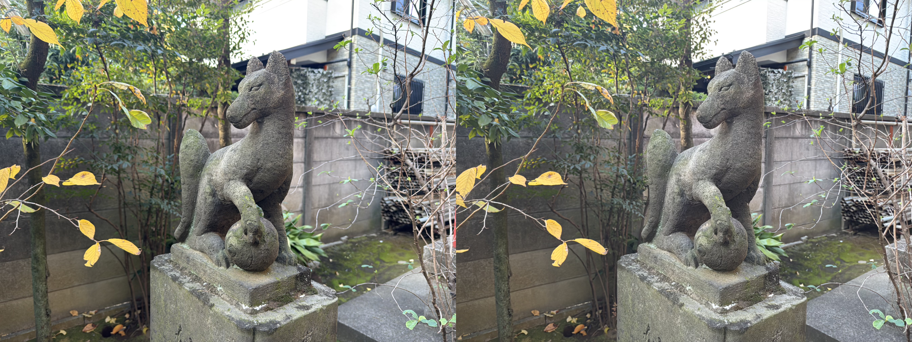

# stereo
Spatial / Stereo photo viewer for WebXR 

WebXR (MetaQuest) and Vision Pro compatible

## usage

include libs 

```
<script src="https://aframe.io/releases/1.6.0/aframe.min.js" crossorigin></script>
<script src="stereo.js"></script>
```

set images

```
<picture >
	<source srcset="img/IMG_4559_p.jpg" media="(max-width: 1200px)"/>
	
</picture>
<button class=vr-btn data-src="img/IMG_4559_p.jpg">Enter VR</button>
<button class=ar-btn data-src="img/IMG_4559_p.jpg">Enter AR</button>
```

 - IMG_4559_p.jpg  :  SBS image parallel 
 - IMG_4559_c.jpg  :  SBS image cross 
 - IMG_4559.HEIC   :  HEIC image for VisionPro  

see [sample.html](https://wakufactory.github.io/stereo/sample.html)
